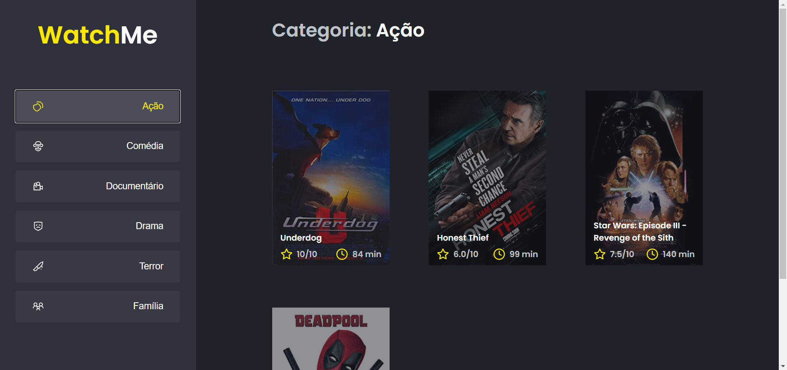
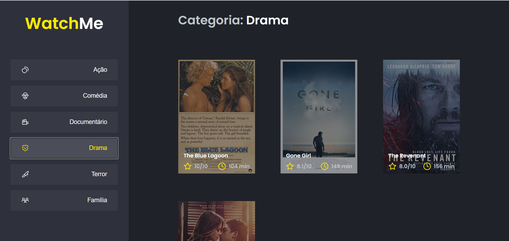

# 🚀👨🏾‍🚀 Journey Ignite Rocketseat -> Challenge02 - Componentizing the application

It is an application whose main objective was to solidify the concepts of componentization in React applications, refactoring the code of a film listing page by genre. The aim was to isolate the responsibilities of the application and facilitate the maintenance of the code.

